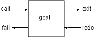
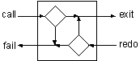
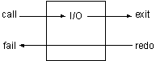
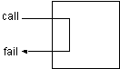
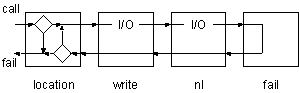
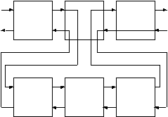

# Glossary - Prolog Jargon

## Programs

* A Prolog `program` is a a Prolog `database`.

---

## Predicates

* A Prolog `program` is composed of `predicates`.

    > procedures, record types, relations.

* `predicate` syntax:

    ```
    predicate(arg1, arg2,...,argN).
    ```

* Each `predicate` is defined by its `name` and `arity`.

* A `predicates` arguments must be valid `terms`. Basic Prolog `terms` are:

    * `integer` - A number. Also floats and other numeric types.

    * `atom` - A string constant beginning with a lowercase letter.

    * `variable` - A string beginning with an uppercase letter or underscore.

    * `structure` - Complex `terms`.

* Two `predicates` with the same `name` and different `arity` are considered to be different `predicates`.

* Each `predicate` in a program is defined by the existence of one or more `clauses` in the database.

---

## Clauses

* A clause can either be a `fact` or a `rules`.

---

## Facts

* `Facts` represent a record in a database.

* __Syntax__

    ```
    predicate(arg1, arg2,...,argN).
    ```

* __Example__

    ```
    human(socrates).
    male(socrates).
    exists(X).
    ```

* `Facts` can be generalized by the use of Prolog `variables`. 

---

## Queries

* A Prolog `listener` (`repl`) can be used to execute `queries` against the `program`.


* __Example__

    ```
    ?- human(X).
    ```

---

## Goals

* A `goal` is a `query pattern`.

* When executing a `query pattern` against a `program`, Prolog tries to reach (`prove`) the `goal`.  

* For `facts`:

    * If there is a `fact` that matches the `goal`, then the `query` `succeeds` and the listener responds with `yes.` 

    * If there is no `fact` that matches the `goal`, then the `query` `fails` and the listener responds with `no.`

* `Goals` can be generalized by the use of Prolog `variables`. 

* Prolog's pattern matching is called `unification`.

---

## Unification

* In the case where the `database` contains only `facts`, `unification` succeeds if the following three conditions hold:

    * The predicate named in the goal and database are the same.
    
    * Both predicates have the same arity.
    
    * All of the arguments are the same.

* `Unification` is a type of `pattern matching`.

* Successful `unification` results in `variable binding`.

---

## Variable Binding

* After successful `unification`, a logical variable takes on the value of the term it was matched with. This is called `binding` the variable. 

* __Example__

    ```
    ?- location(Thing, kitchen).
    Thing = apple ;
    Thing = broccoli ;
    Thing = crackers ;
    no
    ```

---

## Predicate Ports (Goal Resolution)

* When attempting to satisfy a `query goal` Prolog uses the concept of `ports` to manage the search through `clauses` that satisfy the `goal` or `sub-goals`. 

* There are 4 `goal ports`.

* `Goal Ports`

    

    * `call` : Begins searching for clauses that unify with the goal.

    * `exit` : Indicates the goal is satisfied, __sets a place marker__ at the clause and __binds the variables__ appropriately.

    * `redo` : Retries the goal, __unbinds the variables__ and resumes search at the `place marker`.

    * `fail` : Indicates no more clauses match the goal.

---

## Backtracking (`redo` port)

* When a goal `fails` or `exits` with potentially further results, Prolog can `backtrack` by `unbinding` the currently set variable and resuming the search from the `place marker`.

    

---

## Queries

* Simple queries have one clause: `mortal(X).`

---

## Compound Queries

* Simple goals can be combined to form `compound queries`.

* __Conjunction ('and')__

    * Simple goals can be combined to form compound queries.

        ```
        location(Thing, kitchen), edible(Thing).
        ```

        ```
        door(kitchen, Room), location(Thing, Room).
        ```

    * The `scope` of a logical variable is a `query`.

* __Disjunction ('or')__

    * Multiple 

        ```
        location(Thing, kitchen); location(Thing, study) 
        ```

* To understand the execution of a `compound query`, think of the goals as being _arranged from left to right_. 

* Also think of a _separate table_ which is kept for the current `variable bindings`. 

* The flow of control moves back and forth through the `goals` as Prolog attempts to find `variable bindings` that __satisfy__ the `query`.

    > NB: Each goal can be entered from either the left or the right, and can be left from either the left or the right.

---

## Query Interpretation

* Prolog `queries` can be interpreted in two ways:

    ```
    location(X, kitchen), edible(X).
    ```

    * __Logical__ : Is there an X such that X is located in the kitchen and X is edible?

    * __Procedural__ : First find an X located in the kitchen, and then test to see if it is edible. If it is not, go back and find another X in the kitchen and test it. Repeat until successful, or until there are no more Xs in the kitchen.

---

## Built-In Predicates

* Prolog has a set of `built in predicates` / `evaluable predicates` / `extra logical predicates`.

* There are no `clauses` in the database for `built-in predicates`. 

* When the `listener` encounters a `goal` that matches a built-in predicate, it _calls a predefined procedure_.

    > NB: Built-in predicates are usually written in the language used to implement the listener. 

* Built-in predicates _perform functions that have nothing to do with logical theorem proving_, e.g. IO, execution control, etc.

* Since they appear as Prolog `goals` they must be able to respond to either a _`call` from the left_ or a _`redo` from the right_

    * For `call` the in-built predicate is executed and then control always leaves via the `exit` port.

    * For `redo` the in-built predicate is executed and then control always leaves via the `fail` port.

        

* Built-in predicates do no affect the `variable table`,  but they can use values from it.

* Built-in predicates can be used to control program flow. 

    * `fail/0` can be used to __force back tracking__. It gets control from `call` the left and immediately passes control back to the `redo` port of the goal on the left.

        

* __Example__ - Query to display 'everything in kitchen'.

    ```
    location(X, kitchen), write(X) ,nl, fail.
    ```

    
   
---

## Rules

* A `predicate` is either a `fact` or a `rule`.

* A `rule` is a stored `query`.

* `rule` syntax:

    ```
    head :- body_clause_01, ..., body_clause_N
    ```

    > NB: Read - `head if body`.

* __Example__

    ```
    contains_food(Thing, Room) :- location(Thing, Room), edible(Thing).
    ```

    > NB: Read - `Room contains food IF there is a Thing in the Room AND the Thing is edible.

* Rules can have multiple predicates:

    ```
    contains_food(Thing, Room) :- location(Thing,Room), tastes_yummy(Thing).
    contains_food(Thing, Room) :- location(Thing,Room), tastes_yucky(Thing).
    ```

    > NB: It does no matter if it is `tasty` or `yucky`!

* With `rules`, Prolog _unifies_ the `goal pattern` with the `head of the clause`. 

    * If _unification succeeds_, then Prolog initiates a _new query using the goals in the body of the clause_.

* Rules, provide `multiple levels` of `queries`. 

    * The `first level` is composed of the `original goals`. 
    
    * The `second level` is a `new query composed of goals from the body of a clause from the first level`.

    * When the next `clause` is a `rule` unification goes one level deeper.

    * When the next clause is a `fact` unification can continue with the next `clause/goal`.

    * This can continue. Each level can create even deeper levels until the interpreter runs out of space.

        
    
    * The `variables` at different levels are `independent`.

---

## Predicate Chaining - Forcing Success and Failure

* __Forcing Failure__

    * The `fail` predicate can be used to force failure. This can be used to _list_ things.

        ```
        list_things(Place) :-  
            location(Thing, Place),
            tab(2),
            write(Thing),
            nl,
            fail.
        ```
    * When used this `rule` will `fail` to execute any clauses to the _right_.

* __Force Success__

    * This limitation above be overcome by adding a second `list_things/1` clause _which always succeeds_.

        ```
        list_things(AnyPlace).
        ```

    * This can be facilitated with an `anonymous variable`.

         ```
        list_things(_).
        ```   

---

## Arithmetic

* Arithmetic expressions can be expressed with the `is` operator:

    * `X is <arithmetic expression>`

        ```
        ?- X is 3 * (4 + 2).
        X = 18

        ?- X is (8 / 4) / 2.
        X = 1
        ```

    * The variable X is set to the value of the arithmetic expression. On backtracking it is unassigned.

* Arithmetic comparisons can be expressed with the following operators:

    * They succeed or fail according to whether the comparison is true or false.

        ```
        X > Y
        X < Y
        X >= Y
        X =< Y
        ```

---
---

## Appendix A - Query Execution Example

```
% Program

door(kitchen, office).
door(kitchen, cellar).

location(desk, office).
location(computer, office).
location('washing machine', cellar).
```

```
% Query

Goal: door(kitchen, R), location(T,R)

1 CALL door(kitchen, R)
1 EXIT (2) door(kitchen, office)
2 CALL location(T, office)
2 EXIT (1) location(desk, office)
    R = office
    T = desk ;
2 REDO location(T, office)
2 EXIT (8) location(computer, office)
    R = office
    T = computer ;
2 REDO location(T, office)
2 FAIL location(T, office)
1 REDO door(kitchen, R)
1 EXIT (4) door(kitchen, cellar)
2 CALL location(T, cellar)
2 EXIT (4) location('washing machine', cellar)
    R = cellar
    T = 'washing machine' ;
2 REDO location(T, cellar)
2 FAIL location(T, cellar)
1 REDO door(kitchen, R)
1 FAIL door(kitchen, R)
     no
```

---
---

# Appendix B - Useful `in-built` Predicates

## IO Predicates

* `write/1` : This predicate always succeeds when called, and has the side effect of writing its argument to the console. It always fails on backtracking. Backtracking does not undo the side effect.

* `nl/0` : Succeeds, and starts a new line. Like write, it always succeeds when called, and fails on backtracking.

* `tab/1` : It expects the argument to be an integer and tabs that number of spaces. It succeeds when called and fails on backtracking.

* `read/1` : It expects a variable that is assigned the input read.

## Control Predicates

* `fail/0` : It gets control from the left, it immediately passes control back to the redo port of the goal on the left. It will never get control from the right, since it never allows control to pass to its right


